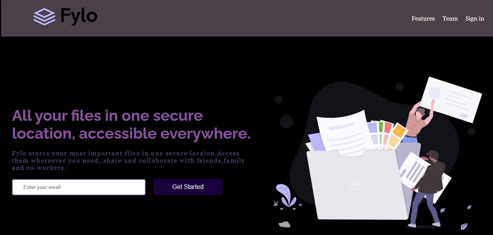
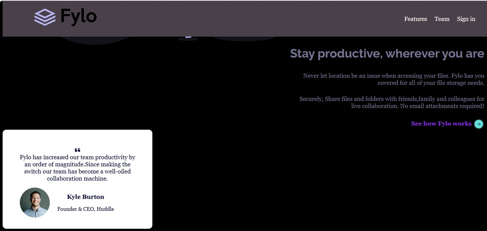

# Fylo Landing Page

Welcome to the Fylo Landing Page repository! This repository contains the source code for a landing page designed for Fylo, a fictional file storage and collaboration platform. The landing page is built using HTML, CSS, and incorporates various libraries and assets for styling and functionality.

## Table of Contents

- [Demo](#demo)
- [Features](#features)
- [Installation](#installation)
- [Hosted Link](#Hosted_Link)
- [Usage](#usage)
- [Contributing](#contributing)
- [Author](#author)

## Demo

## Features

- **Responsive Design**: The landing page is designed to be fully responsive and optimized for various screen sizes, ensuring a seamless user experience across devices.
- **Smooth Scrolling**: Smooth scrolling behavior is implemented for enhanced navigation within the page.
- **Interactive Elements**: Interactive elements such as buttons and input fields provide a user-friendly interface.
- **Social Media Integration**: The footer includes links to Fylo's social media profiles for easy access.

## Installation

To run the Fylo Landing Page locally, follow these steps:

1. Clone this repository to your local machine using `git clone https://github.com/your-username/fylo-landing-page.git`
2. Navigate to the project directory.
3. Open the `index.html` file in your preferred web browser.

Alternatively, you can download the repository as a ZIP file and extract it to your local machine.

## Hosted_Link

[Fylo Landing Page Hosted Link](https://monikaips.github.io/Fylo-revive/)

Users can visit this link to view my Fylo Landing Page deployed on GitHub Pages.

## Usage

Once the Fylo Landing Page is set up locally, you can:

- Explore the various sections of the landing page, including the header, hero section, features section, call-to-action section, and footer.
- Interact with the navigation menu to navigate to different sections of the page.
- Test responsiveness by resizing the browser window or viewing on different devices.

Feel free to customize the content and styles to fit your needs or use it as a template for your own landing page projects.

## Deployment
To deploy the Fylo Landing Page, follow these steps:

Host your HTML, CSS, and any JavaScript files on a web hosting service of your choice. There are many options available, including GitHub Pages, Netlify, Vercel, and more.
Upload your files to the hosting provider's server.
Configure any necessary settings or domain mappings as per the hosting provider's documentation.
Once deployed, your landing page should be accessible via the provided URL.

## Author

- **Monika P** - *Initial work*
